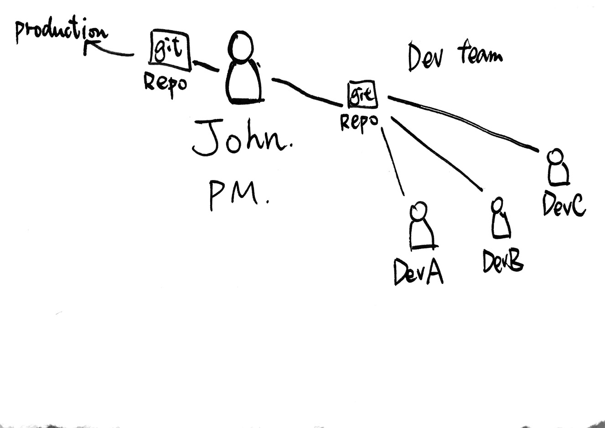

# Chapter 5: Remote and Collaboration

By Makzan, version 1.0, First Draft. 2015-11-21.


## Different roles in Git team

Imagine John is the project manager.

He leads a team of developers.

He setups a git repository for the development team to use.

On the other side, John setups a git repository that connects to production environment.

John, the project manager, check for updates of stable branch from the development’s git repository. Then John pull the code and push to the production git repository.



## Creating a remote repository 

A remote repository is usually a `bare` git folder. It don’t necessary to be in a remote server. Actually we can make it somewhere in the same system.

In this example, we create a remote folder in the same system.

1. Choose a place that’s not part of the current project folder. For example, I chose to make the remote folder in the Dropbox folder.

    ```
    cd ~/Dropbox
    mkdir sample-project-remote.git
    cd sample-projectt-remote.git
    ```

1. Make sure it is an empty folder. Then we run the following `git init` command with the `--bare` option.
    
    ```
    git init --bare
    ```

### What’s happening?

We just created a remote repository. If you list the files and directory inside the remote repository, it looks similar to what you list I the `.git` folder inside our previous got controlled project. 

Note on using Dropbox folder as remote repository

I tried. It works most of the time, until it created inconsistence when 2 or more team members are pushing changes to the remote at the same time.

## Adding remote branch

Commands related to the remote managements are under `git remote` command. 

To add a remote:

```
git remote add <name> <path to the repository>
```

```
git remote add origin ~/Dropbox/remote-sample.git
```

NOTE: This is an example. Using Dropbox may not be an ideal choice for storing and syncing remote repository.

## git clone

Suppose now John’s team has a new member. The new member want a copy of the current git repository. We can achieve that my `git clone`.

We talked about adding remote to an existing git repository. The other way to setup a remote is to create a local repository directly from a remote one. This is known as git cloning. 

```
git clone <remote path> <folder name of local repository>
```

By default, git clone will clone the remote repository into a new directory with the same name, under the current folder. 

The git clone command expects to create that folder. So the operation aborts when the local directory exists. It prevents the git clone command from overriding existing files and data. 

## Git push

When we have a remote, we can `git push` a branch to the remote repository. 

```
git push <Remote name> <Branch name>
```

For example, usually we push to the default remote (origin) and default branch (master).

```
git push original master
```

## Deleting a remote branch 

```
git push origin :feature_a
```

NOTE: remember to type the colon mark. 

According to the spec, we don’t necessary to name the local branch and remote branch the same name. 

```
git push <remote name> <local branch name>:<remote branch name>
```

For example:

```
git push origin new_styles:dev_styles
```

Your local branch may not meet the team standard convention, you can rename it when pushing to the remote branch. 

The same spec, when we ignore the local branch name, it acts as a deletion of remote branch. You may imagine that is pushing a void/null to the remote branch, and thus make the remote branch get deleted. 

## Git pull and git fetch

Once the remote code is changed, we my want to update the local content with the latest changes. We can do that by fetching and merging the code. There is difference on git pull and git merge. 

Git `pull` is `git fetch` and `git merge` combined. 

I often use `git fetch` and `git merge` instead of using the `git pull` command. I use `git pull` only when I know that I’m the only person that are working on that branch.

The reason is that `git pull` automatically merges the remotely changed code into your local branch. That works 99.9%. But in rare case that merging a remote code causes issues on your current codebase. 

So I prefer to fetch the remote code first. In the console, you’ll notice that what files have changed in the external side. You can exam the changes before combining the code into your working environment. If you find issues on the remote changes, you can reject it and request the teammate to improve the code and let you fetch and merge it later after the improvement made.

## git and github

git and GitHub is a different thing.

A git repository is just a storage of code snapshots. 

Github provides additional tools around the git repository. 

For example, github provides:

- web interface to view source code. 
- web interface to change file. 
- Issue tracking
- Collaboration through code comments and discussion. 
- Web interface to render README file into styled HTML format. 
- Wiki to provide additional documentation. 


## Using a github remote branch

Try to create an account in github. 

Add the github repository as a remote origin into the local branch. 

Then try to push the changes there. 

Also try to make some changes directly on the remote branch. And then pull the changes into the local working repository.

NOTE: github is free for open sourced projects and charges for private repositories. Since this is just a practice, creating open sourced projects is enough for the purpose. 

NOTE: github isn’t the only online repository tool. Some others such as Bitbucket and Gitlab provides similar functionalities.


