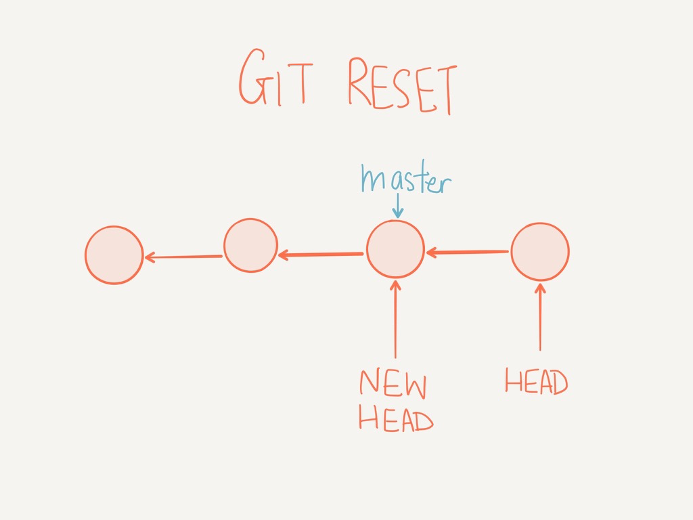
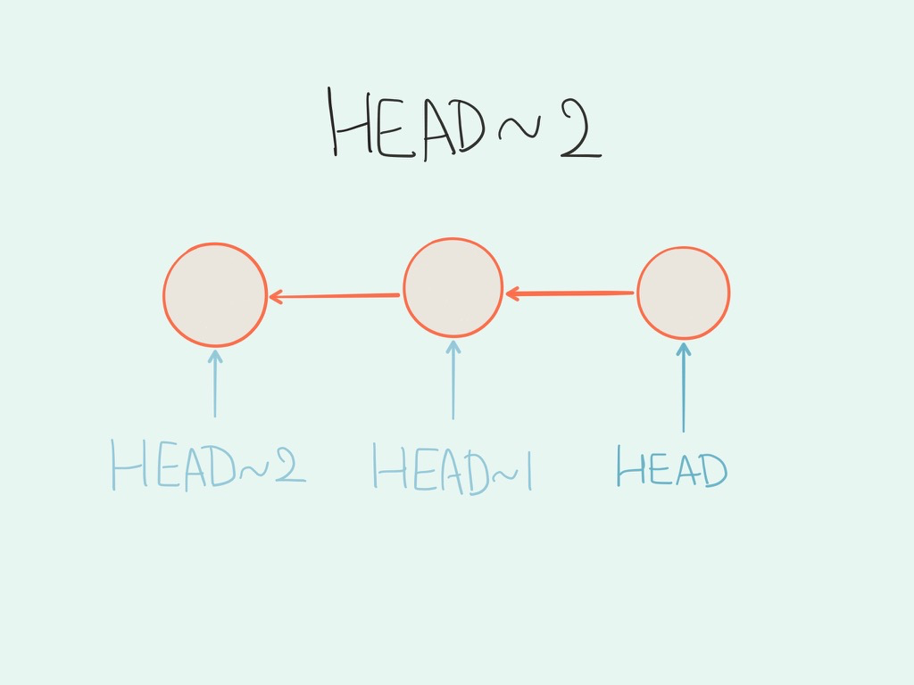

# Chapter 7: Undo Changes

By Makzan, version 1.0.1, First Draft. 2016-11-20.

In git, we have different undo approaches for different scenarios. 

It depends on what we need to do.

For example, if we want to 

- Amend last commit
- Reset several commits
- Revert changes after pushing to a remote branch
- Rebase commits into another commit.

## Undo a hard reset with reflog

We can undo a hard reset with git reflog.

After we do a hard reset, we can’t see the changes of that commit in git log or working directory anymore. But still we can use reflog to rescue recently deleted commits.


```
$ git reflog
7e603f6 HEAD@{0}: reset: moving to HEAD^
29738b4 HEAD@{1}: commit: Test something.
7e603f6 HEAD@{2}: reset: moving to HEAD^
85f5fe2 HEAD@{3}: commit: Test something.
7e603f6 HEAD@{4}: reset: moving to HEAD^
ac7adcb HEAD@{5}: commit: Test something.
7e603f6 HEAD@{6}: reset: moving to HEAD^
4a4ab6e HEAD@{7}: commit: Ignore dot_git.
7e603f6 HEAD@{8}: reset: moving to HEAD^
d2bb180 HEAD@{9}: commit: Add dot_git folder to let student resume my working directory status.
7e603f6 HEAD@{10}: reset: moving to HEAD^
c366c68 HEAD@{11}: commit: Add dot_git to ignore list.
7e603f6 HEAD@{12}: commit (merge): Merge github/master
988b280 HEAD@{13}: commit: Add a call to action text.
39b246b HEAD@{14}: checkout: moving from bbb771688b6ff5a0f114b0e36820e117a8f78736 to master
bbb7716 HEAD@{15}: checkout: moving from master to github/master
39b246b HEAD@{16}: commit: Add logo and links in HTML.
8527471 HEAD@{17}: merge index_b: Fast-forward
8e6852d HEAD@{18}: checkout: moving from index_b to master
8527471 HEAD@{19}: commit (merge): Merge 'index_a'
5b1bad2 HEAD@{20}: commit: Change text in HTML.
8e6852d HEAD@{21}: checkout: moving from master to index_b
8e6852d HEAD@{22}: checkout: moving from index_a to master
f9fca5f HEAD@{23}: commit: Add year to footer copyright.
8e6852d HEAD@{24}: checkout: moving from master to index_a
8e6852d HEAD@{25}: commit: Add tags to HTML file.
5d8c653 HEAD@{26}: reset: moving to 5d8c653
0da344e HEAD@{27}: commit (amend): Add footer tag.
ee60e93 HEAD@{28}: commit: Add fotter tag.
66c7c85 HEAD@{29}: commit: Add <p> tag to paragraphs.
46953e0 HEAD@{30}: commit: Add header tag.
5d8c653 HEAD@{31}: reset: moving to HEAD~1
7d0439b HEAD@{32}: commit: Quick commit
```

From the reflog, we can see the hash ID of deleted commits.

Then we can create a new branch by picking that hash.


```
$ git checkout -b rescue_branch HASH_ID
```

At this moment, we create a branch that points to the deleted commit. Next, we can simply merge the working branch, e.g. master, to the rescue_branch and done.

At last, we can clean up the repo by deleting the temporary rescue_branch.


```
$ git branch -d rescue_branch
```

## Stash working directory

Sometimes you may start changing your code before switching to a new branch. For example, assume that you are in master or development branch with clean working directory. Now you change something in the code file and then you find that you should actually create a new feature branch for that changes. 

You can use git stash to temporary save your current changes.


```
$ git stash
```

This command saves your current status of non-committed changes, so that the working directory becomes clean again.

Now we can create new branch:


```
$ git checkout -b new_feature_branch
```

In the new branch, we can pop the saved state by using `git stash pop`.


```
$ git stash pop
```

Stash allows you to save work-in-progress changes to make the working directory clean. This allows you to save the changes and switch branch to checkout something.

Please note that Git allows you to push and pop the stash in different branch. But it could be confusing when you pop a stash into a commit that was not its original. Except the above example, I usually just commit the work-in-progress changes as a new commit and then reset it later when I’m back. 

## Git reset




Git reset un-commit tracked changes. After a reset, you see commits are removed when you check the git log. The removed changes are put into your working directory, either in staging area or un-tracked changes.

There are three options to perform a reset.

```
git reset --soft
git reset (No option)
git reset --hard
```

NOTE: A `git reset --hard` delete the commit without putting back the changes into working directory. It means those changes are lost.

We need to understand the three stages for file changes. 


/42AC8EFB-F46F-4842-9DB1-E1B6DD71050B.png

Example of reset the last commit

```
git reset HEAD~1
```

The `HEAD~1` means 1 commit before HEAD.


Referencing commits by relative path

When we call `git reset`, we need to specific how many commits to reset. We often use a relative reference. `HEAD~1` means 1 commit before HEAD. `HEAD~2` means 2 commits before HEAD. 




NOTE: `HEAD^` also means 1 commit before HEAD.


## Amend last commit message

We often want to modify last commit.

```
git commit --amend
```

NOTE: This operation should be done before you push the code to any remote branch. Performing undo in remote branch could lead to inconsistent code amount team members.

/08F96AAD-5E4F-48BF-A173-995A04E5CC4E.png

## Revert changes from remote


Usually we want to clean up the commits before pushing the changes to remote.

But if we do need to change something on remote, we can use force push.


```
git push -f origin mater 
```


NOTE: Really be careful when you force push a remote branch. Think twice if you really need to do that. 

NOTE: Github provides a branch protection to prevent unintentional force pushing a remote branch. 


## Undoing Merges

The git-scm has a blog post that talk about undoing merges.

http://git-scm.com/blog/2010/03/02/undoing-merges.html


## Group commits into 1 commit with git reset


We can group multiple commits into 1 commit by using git reset.

NOTE: Please don’t reset commits that have already pushed on remote repository.

## Git Revert

`TODO`


