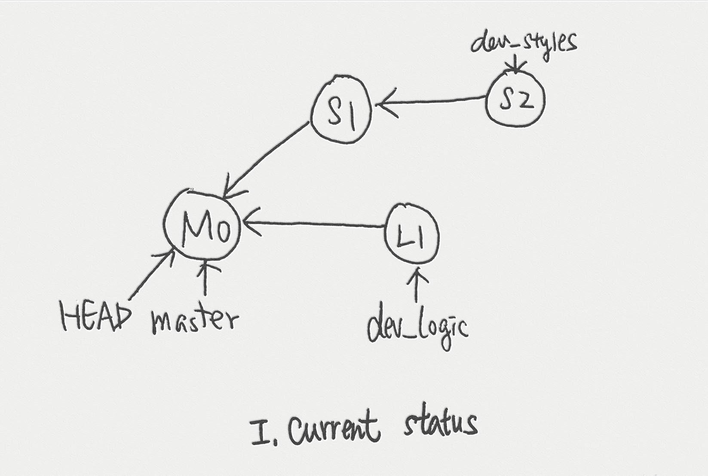
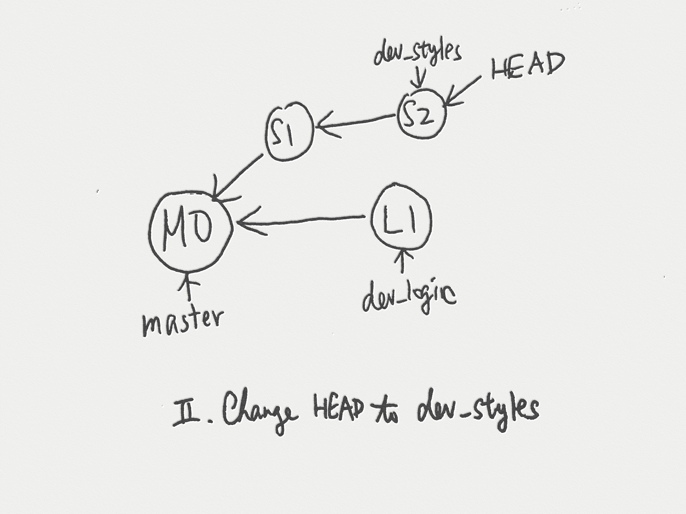

# Chapter 8: Rebase and Cherry Pick

By Makzan, version 1.0, First Draft. 2015-11-21.

Git rebase is an advanced and powerful technique. It is like merge, but it doesn’t create new commits from 2 branches. It grab the diffs from a branch and re-apply those diffs into the other branch.

Rebase allows us to move a tree of snapshots into a new parent snapshot. 


After the rebase, the log history looks like a single timeline.


## Rebase Example




For example, there are 2 feature branches, **dev_logic** and **dev_styles**. We are in master. We want to merge these 2 branches so that they have linear history, as if one feature is developed following the other feature.




We want to checkout one of the branch. In this example, we checkout dev_styles.


Then we call `git rebase -i dev_logic`. After going through the interactive mode, we end up have dev_styles applying after `dev_logic`.

I like to use interaction mode because I can go through the rebase step-by-step. In between, I can also squash multiple commits into 1 commit.


Please note that rebase is not moving commits to the target branch. It is re-creating commits on the target branch. The SHA hash is different after rebase. So don’t rebase branches that have already push to remote because others may have already working on it.


## Git pull with rebase

We can config git pull with rebase instead of merge.

```
$ git pull --rebase origin master
```

But as I mention git pull = git fetch + git merge. I would recommend doing a git fetch + git rebase instead of using the git pull. 


## Fast-forward with Rebase

When we learn git merge, we can fast-forward a left-behind branch by the following steps:

Scenario: Assume we are in development branch, we want to fast-forward the master branch–which is 10 commits behind–into the development branch. 

1. git checkout master
2. git merge development

By using rebase, we can use 1 step to archive the same effect:

1. git rebase development master

It means checkout master branch and rebase master onto development.

## Cherry Pick

Cherry pick is **re-applying** changes of a selected commit into the current HEAD. 

It’s often use when we want to apply a patch from a branch into the other branch, where merge or rebase is not preferred. 

For example, there is a product with both version 2.x and 3.x in active development. Assume that the team is actively working on 3.x and maintaining 2.x with latest security patch. 

If now the developer team just update a security patch to 3.x on a component that shared between both versions. We want to apply the same patch to the version 2 too. Since the branch for version 3 and 2 is diverse, merging them is not possible way. We can apply just the patch to version 2 by cherry pick.

Scenario: Now we just created a security patch as a commit in branch v3. We want to apply this commit on v2. 

1. Use git log to find out the Hash of the commit. Assume it is `abc1234`.
2. Checkout branch of version 2

    ```
    $ git checkout v2 
    ```

1. Use cherry-pick to apply the patch onto the current branch, which is v2.

    ```
    $ git cherry-pick abc1234.
    ```

This command create a new commit on v2, with the content and comment exactly the same as abc1234. It is a clone of abc1234, but applied to a different branch, a different place.


