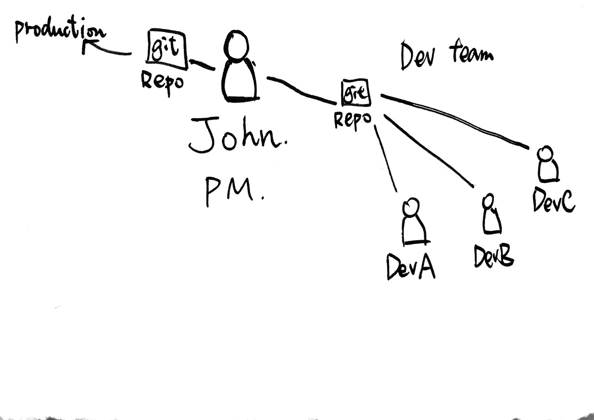

# Beginning Git Version Control

By Makzan, v1.0.3, June 30th, 2017. First Draft.

# Introduction

In this book, we will go through the basic concept of Git version control.

I design this book as a journey of the main character name John. He is an IT manager that manage a team of developers. He is also in charge of deploying the code to the production server. 

# Why this git book?

Git is getting more and more powerful. It means more and more commands for us to control every little detail of code changes. That’s good. But as a new learner, I trim the content to provide only the essential concepts and the best practices.

For example, I recommend `git fetch` + `git merge` always instead of `git pull`. You’ll learn all these commands in elsewhere, but in this book, I tell the _why_ and their pros and cons. (In chapter 5)

## About Author

I am Thomas Seng Hin Mak, but you may find me on Internet as “Makzan”.

I have been using git version control since 2009. Before moving to git, I used SVN in a game development team. I changed to use git personally and then encouraged the whole team to move to git. Afterwards, I tried different git version control flow in different team, including HTML5 games development, book writing, iOS app development and web projects. I also used different remote repository approaches, such as GitHub, Bitbucket, self-hosted git and Dropbox sync. 

## Book Status

The book is in first draft stage. That means content is raw and in-edit. 

I follow the lean publishing philosophy. We make the book published as soon as it is written. Then we update the book periodically.

You will also find the version status in each chapter. 

/Version History.md


## Version history:

- 2015-11-23: First draft
- 2015-12-07: Working on the remote content. 
- 2015-12-28: Write more about merge, rebase, cherry-pick and submodule.
- 2016-11-07: Organize content into HTML format.
- 2016-11-20: Minor fixes and PDF output.
- 2016-11-21: Add config of quote path.
- 2017-06-30: Moved the manuscript to Ulysses and setup Leanpub. Added “Why this book” section.

# Book reference
This short book provides only the essential techniques to help you get started using git version control. It’s a tips and tricks sharing from my 8 years of experience. 

If you need to reference certain concepts of commands, I recommend reading the [Pro Git](https://progit.org/) book, or its web format on [git-scm.com](http://git-scm.com/).

That is the go-to book to learn git. You can also find the reference of git commands on  [git-scm.com/docs](http://git-scm.com/docs).

Besides the Pro Git book and the official reference, there are some other online resources:

- [Git Ready](http://gitready.com/)
- [Git Pretty](http://justinhileman.info/article/git-pretty/) 


# Beginning of the story
This book is a journey of how the imaginary project manager—John—manages his IT development project with Git version control.

Meet John. He is an IT manager who manages a team of developers. This is a software company that builds web application. They need to manage production servers that serves their code. They also have a staging server for internal testing. Within the team, several developers work together with local development machine. 

They have been using SVN for their version control. Now they want to migrate to use Git version control. 

This is a short journey about how John’s team learn to manage their source code with git version control. 


## Why Git?

Here are some advantages of Git version control.

- Git is fast. 
- Git is local hosted.
- Git repository is distributed.

# Chapter 1: Basic Command

In this chapter, we will explore the fundamental things to get started using git version control. 

We will learn to:

- Install and init a git repository.
- Commit the changes as snapshot into the repository.
- Write helpful commit messages.
- View the current changes status.
- View the history log of the commit snapshots.

## Install and Config
This section covers the git program installation and configuration.

### Installation

John’s team has development machines running Windows and Mac. The servers are running Linux. To begin with git version control, the team install the git program in these operating systems.

In Windows, they use the installer because it handles everything we need to run git on Windows. It also include a GUI helper. In Mac, the git comes with Xcode—A development IDE for Mac. In some Mac that don’t have Xcode installed, they install the git program with the brew.

In their Linux server, the team uses the build in package manager, e.g. apt-get for Ubuntu, to install the git program. 

Now, assuming we are part of John’s team. We are going through the class to learn git version control to fit our development team’s code versioning requirement.

### Configuration

After installed the git program, we need to config it. At least, we need to set the username and email address so that we can know who is making changes on the code.

In command prompt, run the following command.

NOTE: This is my information, you may want to set yours.

Set up user name and email:


	git config --global user.name "Thomas Seng Hin Mak"
	git config --global user.email "mak@makzan.net"


This is the information that we can trace who has been working on what later when we need to collaborate the code with other members in the team.

NOTE: You can set project specific name and email by running the `git config` command without the `--global` option.

## Setting up filename for unicode

You can set Git to use unicode in filename by configuring the following:


	git config --global core.quotepath false


## Init and First Commit
In the following steps, we will learn the very basic commands to control a project folder with git. Then we will make changes to the project files and save the snapshots into the git repository.

### Time for Action—Project initialization

1. Create a folder for our project. Let’s name it “Sample Project”.
2. Create some files inside the project folder. Optionally, put some dummy content in the files.
3. Run the `git init` command.


		git init


The `git init` initials the current folder as a git controlled repository.

4. Run the `git add .` command to mark the files to be version controlled.

		git add .


	`git add` requires the input of files to be added. the `.` means adding all files in the current directory.

5. Run the following `git commit` command to commit the marked files into the repository. This is the step that really save the changes as a snapshot.


		git commit -m “First commit.”


NOTE: As a beginner, it’s easy to forget the commit message. `git commit` requires the message exists, but sometimes beginners simply avoid it by using `-m “”`.

### Further steps
We have learnt the `add` and `commit` command. By using these commands, now you can make changes on your files/source code. When you feel that needs a snapshot, you can `git add` the changed files and `git commit` them into the version-controlled repository.


NOTE: You can combine the `add` and `commit` into one command: `git commit -am ‘<MESSAGE>’`. It adds all the changes into commit. Use it carefully.

## Writing git commit message

There are some points that we need to know about writing git commit messages. 

1. Use present tense. 
2. Begins with a verb. Just omit the subject because it is always “I”, the developer. 
3. Use the first line as summary. 
4. For a long message, use the text editor instead of the one line option `-m`. For a long message, add two line breaks and write the detail after the first summary line. 

It’s not required to mention file names in message. The file changes can be viewed in the log. No need to mention the file unless you need to refer to the file in your message. 


## Current Changes Status

We can observe the current status by using the `git status` command. 

For example, when we run the `git status` command in a directory with changes, we will see he following result. 


	On branch master
	Your branch is up-to-date with ‘origin/master’.
	
	Changes not staged for commit:
	  (use “git add <file>...” to update what will be committed)
	  (use “git checkout -- <file>...” to discard changes in working directory)
	
			modified:   app/assets/javascripts/application.js
			modified:   app/views/documents/_form.html.erb
			modified:   app/views/documents/show.html.erb
	
	Untracked files:
	  (use “git add <file>...” to include in what will be committed)
	
			app/assets/javascripts/components/last-save.js.jsx
			vendor/assets/javascripts/moment.js


For the status, you may observe that there are two stages of files: (Actually there are three, we will go through it later)

1. Un-staged file changes, in red color. 
2. Staged file changes, in green color. 

The third stage is `committed` file changes, which is stored as a snapshot in the git repository and hidden in the `git status` command. 

**Help message**

In the git status, there are helping messages that guides you the next actions you can perform on those changes. 

For example, it tells you that you can use add to stage the changes. And you can use checkout to un-stage the changes.

**Short version**

There is a short version of the status. If you are really familiar with the status output and what you can do with those changes, you can turn off all the unnecessary output by using the option `--short`, or `-s`.

`TODO`: make sure the options are correct. 


## Commit log

The log shows the history of the commit snapshots. 

There are several log options. The default one isn’t such useful actually. 

I usually view my log with the following options. 

	$ git log --oneline  --graph --decorate --color --all


It’s a very long command, right? So I usually set it as an alias command. This can be done by setting the alias in the `.gitconfig` file. 

	[alias]
	  lg = log --all --oneline --graph --decorate --color


NOTE: The `.gitconfig` file is usually in the home directory.

Please refer to “Git Alias Configurations€” for git command alias.

### Explaining

So what does those options mean?

The `--oneline` shows the simplified version. 

The `--graph` shows the commit relationship path on the left. So that the sequence of log becomes a commit path. 

The `--all` shows all branches, including the remote branch. Otherwise, `git log` only shows the current branch. 

The `--decorate` shows the branch pointers to the commits. 

The `--color`, as the name suggests, makes the log output colorful and easier to read. 


## Migrate from SVN

John’s team uses SVN to control their code before moving to Git.

If you have version control experience with SVN, here is what’s similar and what’s difference. 

**Workflow**

At the beginning of learning git, you may follow the workflow of SVN. In the morning, you check out the code from the centralized repository. You work on your code. During lunch break or get off the work at evening, you check in the code and merge your changes into the centralized repository.

When you follow this SVN approach, you don’t get much benefits of using git. Git’s power comes from it’s distributed local repository. But it’s a good starting point to get familiar with the git command.

### The similar

In collaboration, you need to push your code to a centralized server. Others pull and merged your code. 

### The difference

The repository is stored locally. The remote one is a duplicated one. Every local repository is a full working copy.


### Technically

The merge is done in local instead of in the server. 

Branch is essentially a pointer. Creating a new branch on a current state only creates a new pointer. In SVN, it copies a new folder and files to create branch. 


### Benefit of storing repository locally

- You can work offline. You may be on train, on flight, on trip with no internet access. You’re disconnected and this is the best time of working. So you can continue on your code. Make changes and commits local. Exploring and experimenting freely.
- Super fast response. Git encourages developers to create branches and experiment with code, because every changes are tracked. This confidence come from it’s fast response when creating and switching branches. This is because these repository operations are done locally. And because its mechanism optimists on branch switching.
- Review before push. Git encourages creating branches and committing without worrying about losing the code. There are chances that the commits tree and branches become messy and complicated. Since all those commits are local only until we push those commits to a remote branch, we can re-organizing them before push them to remote.


# Chapter 2: Behind the Scheme

In this chapter, we learn how git works behind the scene. Specifically, we will learn:

- How git manage snapshots.
- How git manage branch pointers.
- The 3 stages of tracking changes.


## The .git folder

After git init the current folder, git creates a `.git` folder in the project directory.

The `.git` folder contains every thing git needs to maintain the repository. 

## The different stages of changes tracking

There are several stages for a file. 

They are: 

1. untracked files
2. tracked files with non-staged changes
3. tracked files with staged changes
4. committed changes

You can see the stages of the changes when you `git status` your project folder.


	Your branch is up-to-date with ‘origin/master’.
	
	Changes not staged for commit:
	  (use “git add <file>...” to update what will be committed)
	  (use “git checkout -- <file>...” to discard changes in working directory)
	
			modified:   app/controllers/folders_controller.rb
			modified:   app/views/folders/show.html.erb
			modified:   config/routes.rb
	
	Untracked files:
	  (use “git add <file>...” to include in what will be committed)
	
			app/views/folders/_public_list_document.html.erb
			app/views/folders/public_folder.html.erb
	
	no changes added to commit (use “git add” and/or “git commit -a”)


### Untracked files:

The file is usually new and haven’t been tracked yet. 

NOTE: If you don’t want a specific file to be tracked. You should add it to `.gitignore` file. Don’t just leave that file there showing up every time when you view the `git status`. It’s because we want to make sure we can reach the state of clean working directory.

Here is how a clean git status looks like:


	On branch master
	
	nothing to commit, working directory clean


### Changed but un-staged:

The file is under tracked and there are changes since last commit. 

### Staged:

The changes is marked and will be added to repository in next commit. 

	 [Reference of staging area](http://git-scm.com/about/staging-area) 

### Committed:

The changes are stored in the git repository. You can’t see it in `git status`. But you can view them by using `git log`. 

When we learn how to undo changes by using `git reset`, we will need the concept of these stages.


## Snapshots links

When we commit changes into a snapshot, git saves the diff. 

Each snapshot points to its parent. 

And there are pointers pointing to the last commit. 

So given any snapshot, we can trace the changes back to its root, first, snapshot. 

It given any snapshot, we can construct the files by applying the diff patches from its root snapshot. 

You can foresee from their mechanism that this design approach is good for source code and plain text files. It uses text patches to maintain the version changes.

But if we do version control with binary files, such as `.psd` format, it needs to store the file for each commit. 


# Chapter 3: Essential Techniques

We have learned the basic commands to keep adding changes as snapshots. It’s time to learn more techniques.

## Git add interactive

`git add` comes with an interaction mode.

	$ git add -i
			   staged     unstaged path
	  1:    unchanged        +2/-2 index.html
	
	*** Commands ***
	  1: status       2: update       3: revert       4: add untracked
	  5: patch        6: diff         7: quit         8: help
	
	What now> 2
			   staged     unstaged path
	  1:    unchanged        +2/-2 index.html
	Update>> 1
			   staged     unstaged path
	* 1:    unchanged        +2/-2 index.html
	Update>> 
	updated one path
	
	What now> 1
			   staged     unstaged path
	  1:        +2/-2      nothing index.html
	
	*** Commands ***
	  1: status       2: update       3: revert       4: add untracked
	  5: patch        6: diff         7: quit         8: help


You can use the command to add file by choosing their index number.

You can also use `patch` to add line by line inside a file.


	Stage this hunk [y,n,q,a,d,/,s,e,?]? ?
	y - stage this hunk
	n - do not stage this hunk
	q - quit; do not stage this hunk nor any of the remaining ones
	a - stage this hunk and all later hunks in the file
	d - do not stage this hunk nor any of the later hunks in the file
	g - select a hunk to go to
	/ - search for a hunk matching the given regex
	j - leave this hunk undecided, see next undecided hunk
	J - leave this hunk undecided, see next hunk
	k - leave this hunk undecided, see previous undecided hunk
	K - leave this hunk undecided, see previous hunk
	s - split the current hunk into smaller hunks
	e - manually edit the current hunk
	? - print help


For example:


	What now> s
			   staged     unstaged path
	  1:    unchanged        +2/-2 index.html
	
	*** Commands ***
	  1: status       2: update       3: revert       4: add untracked
	  5: patch        6: diff         7: quit         8: help
	What now> p
			   staged     unstaged path
	  1:    unchanged        +2/-2 index.html
	Patch update>> 1
			   staged     unstaged path
	* 1:    unchanged        +2/-2 index.html
	Patch update>> 
	diff --git a/index.html b/index.html
	index 5ba3e85..df49622 100644
	--- a/index.html
	+++ b/index.html
	@@ -1,5 +1,5 @@
	-This is HTML Sample.
	+This is HTML Sample for my Git course.
	 
	 Title: This is a sample.
	 
	-Footer: Copyright.
	\ No newline at end of file
	+Footer: Copyright 2016.
	\ No newline at end of file
	Stage this hunk [y,n,q,a,d,/,s,e,?]? ?
	y - stage this hunk
	n - do not stage this hunk
	q - quit; do not stage this hunk nor any of the remaining ones
	a - stage this hunk and all later hunks in the file
	d - do not stage this hunk nor any of the later hunks in the file
	g - select a hunk to go to
	/ - search for a hunk matching the given regex
	j - leave this hunk undecided, see next undecided hunk
	J - leave this hunk undecided, see next hunk
	k - leave this hunk undecided, see previous undecided hunk
	K - leave this hunk undecided, see previous hunk
	s - split the current hunk into smaller hunks
	e - manually edit the current hunk
	? - print help
	@@ -1,5 +1,5 @@
	-This is HTML Sample.
	+This is HTML Sample for my Git course.
	 
	 Title: This is a sample.
	 
	-Footer: Copyright.
	\ No newline at end of file
	+Footer: Copyright 2016.
	\ No newline at end of file
	Stage this hunk [y,n,q,a,d,/,s,e,?]? s
	Split into 2 hunks.
	@@ -1,4 +1,4 @@
	-This is HTML Sample.
	+This is HTML Sample for my Git course.
	 
	 Title: This is a sample.
	 
	Stage this hunk [y,n,q,a,d,/,j,J,g,e,?]? y
	@@ -2,4 +2,6 @@
	 
	 Title: This is a sample.
	 
	-Footer: Copyright.
	\ No newline at end of file
	+Footer: Copyright 2016.
	\ No newline at end of file
	Stage this hunk [y,n,q,a,d,/,K,g,e,?]? d
	
	*** Commands ***
	  1: status       2: update       3: revert       4: add untracked
	  5: patch        6: diff         7: quit         8: help
	What now> s
			   staged     unstaged path
	  1:        +1/-1        +1/-1 index.html
	
	*** Commands ***
	  1: status       2: update       3: revert       4: add untracked
	  5: patch        6: diff         7: quit         8: help
	What now> q
	Bye.
	$ git st
	On branch index_b
	Changes to be committed:
	  (use “git reset HEAD <file>...” to unstage)
	
			modified:   index.html
	
	Changes not staged for commit:
	  (use “git add <file>...” to update what will be committed)
	  (use “git checkout -- <file>...” to discard changes in working directory)
	
			modified:   index.html
	
	$ git diff --cached
	diff --git a/index.html b/index.html
	index 5ba3e85..68b050a 100644
	--- a/index.html
	+++ b/index.html
	@@ -1,4 +1,4 @@
	-This is HTML Sample.
	+This is HTML Sample for my Git course.
	 
	 Title: This is a sample.
	 
	$ git diff
	diff --git a/index.html b/index.html
	index 68b050a..df49622 100644
	--- a/index.html
	+++ b/index.html
	@@ -2,4 +2,4 @@ This is HTML Sample for my Git course.
	 
	 Title: This is a sample.
	 
	-Footer: Copyright.
	\ No newline at end of file
	+Footer: Copyright 2016.
	\ No newline at end of file
````

## Check out specific commit

We can check out specific commit by using the following command.

````
git checkout \<commit hash\>
````

The commit hash is a 40 characters length of alphanumeric. We don't necessarily need to write the all 40 characters. Just include the first few characters to allow git to identify that commit. For example: `git checkout 123456` would be enough most of the time to identify a unique commit. 

When you checkout certain commit. You’ll notice two things:

1. The git checkout command prints a large paragraph of text. It is to warn you that you have checked out a branch without any pointers. That means that is a detached branch without any branch name. We usually checkout and work on branch instead of directly referring to commit hash. 
2. The files in the working directory changes to the state of that commit. Don’t worry, our commits are safe and we can checkout our latest code by doing `git checkout master`.

Read the "branch" and "git flow" section for more about using branches. 

## Creating branch

We can create branch by using `git checkout -b`.

For example, the following command creates a new feature branch.


	git checkout new_feature


This creates a new branch. But actually nothing really changes here until we create new commits. When you git log the commits, you still see the same commits graph. The only difference is now there is a new_feature brands name appears at where the HEAD at. 

We will see how branch works when we make changes and commit it. Afterwards, the git log shows commit graph that contains the new_feature and the master, which points to two different commits. This is because we created a branch from where master pointed at and then move forward with new commits. 

To make things more interesting, now we go back to where master points at. To go back, we `git chrckout master`.

Now we make some other changes on master and commit it. When we git log to see the commit graph, we see two commits are diverse into two direction, both from the same parent commit but now one is master and the other is `new_feature`. The HEAD points to the current commit. When we `git checkout new_feature` again, we can see the HEAD now points to new_feature. 

## git merge

After we created different branches, we need `git merge` to merge the current branch into the other branch.


	(master branch)$ git merge feature_a


It’s result is a recursive merge. That happens when we merge 2 branches that has a different commits history.


/05A54CFB-1015-4255-A152-E039DC502658.png

Afterwards, we may checkout the `feature_a` branch and merge to `master`.


	$ git checkout feature_a
	$ git merge master


It’s result is a fast-forward merge. That happens when we merge branches that is in the same timeline.

## Git diff


Diff between un-staged changes and staged / commuted changes: 

	git diff


This compares the current non-added changes with the last commit in the current branch.


	git diff --cached


`--cached` compare the staged changes (added but not committed) with the  last commit in the current branch.

	git diff branchA branchB

Why need to diff before committing?

We want to check what’s the changes between the latest code and the last committed code. 

Assume the following `git status` result. We see that there are two files changes. One file is `last-save.js.jsx` and the other one is `app.css.scss`.

An example of git status with two changes files:


	$ git status
	On branch master
	
	Changes not staged for commit:
	  (use "git add <file>..." to update what will be committed)
	  (use "git checkout -- <file>..." to discard changes in working directory)
	
			modified:   app/assets/javascripts/components/last-save.js.jsx
			modified:   app/assets/stylesheets/app.css.scss
	
	no changes added to commit (use "git add" and/or "git commit -a")


Then, we use the `git diff` to check the code changes before committing them into the repository.

In the diff, we find that the 2 files are actually 2 different things. One file is a React JS view component and the other is a CSS styling improvement. We didn’t commit before making changes to another feature.

We add 1 file and commit it, then we commit another file.

And result in two different commits for two different purposes. 

## Maintaining a clean commit history

Before we commit, we may want to clean the commit to make it containing only what’s relevant. 

So each commit should make changes on only one thing. 

For example, it is a good habit to check the changes difference with `git diff`. 

## Daily Workflow
Every day, here is the workflow. 

1. Fetch to see if there is any new updates from your team mates.
2. If the team mates has updated code in your working branch, merge that branch with priority.
3. Check what's the work in progress branch.
4. Check out the working branch and start writing the code.
5. When there is enough changes made, commit the changes to make a snapshot. 

## Git Alias Configuration

We can set alias in the `.gitconfig` file.

	
	[alias]
		st = status
		lg = log --all --color --graph --pretty=format:'%Cred%h%Creset -%C(yellow)%d%Creset %s %Cgreen(%cr)%C(bold blue)<%an>%Creset' --abbrev-commit
		ll = log --all --oneline --graph --decorate --color

NOTE: Most likely the `.gitconfig` file is in current user’s home directory.

## Ignoring files with .gitignore

the `.gitignore` file allows us to list files that we don’t want to track at all. These files won’t appear as “Untracked files” when viewing the `git status` result.

You can ignore an entire folder by specifying the folder name. Or you can ignore certain type of files with the wildcard character. For example: `build/*.exe`.

We usually want to ignore the build and output because these can be compiled. In version control, we control the source code.

NOTE: You can still force adding files that is ignored by using the `git add -f` option.

## Git tracks files, not folder

Git doesn’t track folder.

If we need to track folder, we usually add a hidden file there. Community often use an empty `.gitkeep` file for this purpose. But it’s not a standard.


# Chapter 4: Flow Control

There are different flow control approaches we can follow when using Git within a team.

## Git flow
There is a flow on switching branches. It’s an organization of branches that each branch indicates a meaning.

* Master
* Staging 
* Development
* Deploy
* Hot fix 
* Features 

There is a branch dedicated to stable commits. Then there is a branch that contains latest working code, which is often “master”. There is a “development” branch which contains commits that may break.

Then for each new feature, we create a branch from the “development” branch. We may call it `fea_name` or `dev_name`. 

For example, `dev_auth` or `dev_saving_record`.

Eventually, these feature branches are merged into the development branch. When the code passes the quality test, it will be pushed to staging branch for further testing. Finally, the code will be pushed to the deployment branch which will be built into production environment.


NOTE: In some git flow, the master is used as the stable branch. Then a development branch is created to represent the current developing code. On the other hands, some teams chose to make master the current developing branch. They create another branch, usually named “stable” or “deploy”, to represent the current stable code that is on production environment.

To make thing clear,  in my book, I will refer to the production ready branch as “deployment”, and the developing code branch as “development”. When I mention “master”, usually it is not related to the git flow.

## Hierarchy

We can setup hierarchy.

That controls people and how they access the repo. Also how they do  on each step of development. 

For example, the development team

And the project manager manages

Then there is a QA team to perform quality testing

There is one man in charge of deploying the code to master. 

## Hot fix branch
When the code in production has bug, we want to fix it based on the production code. This is almost the only case that we will make changes directly on the deployment branch. 

In such case when a serious bug is found in the deployment branch. We check out the deployment branch and create a new branch. Usually we call the branch "hotfix".

Then we commit the changes on this hot fix branch and push back  to the deployment branch when we are done. 

These changes are then pull back to the master/development branch. And team members may (or may not) merge the changes into their development branch. It depends if the changes affects the current developing features. 

If the hot fix doesn't affect existing developing features, developers don't need to merge that changes. The code will merge in master/development branch when developer finished the feature branch and push to the master. 

## Feature development branch

Development branch 

Under this branch, we work on new features. 

For each feature, we create a feature branch. 

Each feature branch is responsible for a single feature. 

Under each feature branch, we are freely to create sub branch as much s we like. These branches are treat as the experiments on specific feature. 

For examples, given a feature requirement, there could be more than one way to solve the problem. And sometimes we don't know which one is better until we do some exploring. Creating branches allows us to explore the code into two, or several, very different directions, without each code conflicting with each other. 


## Stable deployment branch

TODO: The stable deployment branch


## Git Merge with --no-ff

When we merge development branch into stable branch, we may choose to git merge with option `--no-ff`. This means even the stable branch can be fast forward, we still want a new commit to create. In such case, when we git log the graph, we can always see that that is a merge with 2 parents node. 

In other branches, such as development and features branches, I still use normal merge or rebase.


# Chapter 5: Remote and Collaboration

The beauty of git version control is that enables flexible collaboration between team members or even external developers.

## Different roles in Git team

Imagine John is the project manager.

He leads a team of developers.

He setups a git repository for the development team to use.

On the other side, John setups a git repository that connects to production environment.

John, the project manager, check for updates of stable branch from the development’s git repository. Then John pull the code and push to the production git repository.




## Creating a remote repository 

A remote repository is usually a `bare` git folder. It don’t necessary to be in a remote server. Actually we can make it somewhere in the same system.

In this example, we create a remote folder in the same system.

1. Choose a place that’s not part of the current project folder. For example, I chose to make the remote folder in the Dropbox folder.

		cd ~/Dropbox
		mkdir sample-project-remote.git
		cd sample-projectt-remote.git

1. Make sure it is an empty folder. Then we run the following `git init` command with the `--bare` option.
2. 
		git init --bare

### What’s happening?

We just created a remote repository. If you list the files and directory inside the remote repository, it looks similar to what you list I the `.git` folder inside our previous got controlled project. 

Note on using Dropbox folder as remote repository

I tried. It works most of the time, until it created inconsistence when 2 or more team members are pushing changes to the remote at the same time.

## Adding remote branch

Commands related to the remote managements are under `git remote` command. 

To add a remote:

	git remote add <name> <path to the repository>

	git remote add origin ~/Dropbox/remote-sample.git


NOTE: This is an example. Using Dropbox may not be an ideal choice for storing and syncing remote repository.

## git clone

Suppose now John’s team has a new member. The new member want a copy of the current git repository. We can achieve that my `git clone`.

We talked about adding remote to an existing git repository. The other way to setup a remote is to create a local repository directly from a remote one. This is known as git cloning. 

	git clone <remote path> <folder name of local repository>


By default, git clone will clone the remote repository into a new directory with the same name, under the current folder. 

The git clone command expects to create that folder. So the operation aborts when the local directory exists. It prevents the git clone command from overriding existing files and data. 

## Git push

When we have a remote, we can `git push` a branch to the remote repository. 


	git push <Remote name> <Branch name>


For example, usually we push to the default remote (origin) and default branch (master).


	git push original master


## Deleting a remote branch 

	git push origin :feature_a


NOTE: remember to type the colon mark. 

According to the spec, we don’t necessary to name the local branch and remote branch the same name. 


	git push <remote name> <local branch name>:<remote branch name>


For example:


	git push origin new_styles:dev_styles

Your local branch may not meet the team standard convention, you can rename it when pushing to the remote branch. 

The same spec, when we ignore the local branch name, it acts as a deletion of remote branch. You may imagine that is pushing a void/null to the remote branch, and thus make the remote branch get deleted. 

## Git pull and git fetch

Once the remote code is changed, we my want to update the local content with the latest changes. We can do that by fetching and merging the code. There is difference on git pull and git merge. 

Git `pull` is `git fetch` and `git merge` combined. 

I often use `git fetch` and `git merge` instead of using the `git pull` command. I use `git pull` only when I know that I’m the only person that are working on that branch.

The reason is that `git pull` automatically merges the remotely changed code into your local branch. That works 99.9%. But in rare case that merging a remote code causes issues on your current codebase. 

So I prefer to fetch the remote code first. In the console, you’ll notice that what files have changed in the external side. You can exam the changes before combining the code into your working environment. If you find issues on the remote changes, you can reject it and request the teammate to improve the code and let you fetch and merge it later after the improvement made.

## git and Github

git and Github is a different thing.

A git repository is just a storage of code snapshots. 

Github provides additional tools around the git repository. 

For example, Github provides:

- web interface to view source code. 
- web interface to change file. 
- Issue tracking
- Collaboration through code comments and discussion. 
- Web interface to render README file into styled HTML format. 
- Wiki to provide additional documentation. 


## Using a Github remote branch

Try to create an account in Github. 

Add the Github repository as a remote origin into the local branch. 

Then try to push the changes there. 

Also try to make some changes directly on the remote branch. And then pull the changes into the local working repository.

NOTE: Github is free for open sourced projects and charges for private repositories. Since this is just a practice, creating open sourced projects is enough for the purpose. 

NOTE: Github isn’t the only online repository tool. Some others such as Bitbucket and Gitlab provides similar functionalities.


# Chapter 6: Conflicts

New git learner often worry about conflicts. If we plan our branches carefully, the conflicts are usually not difficult to fix.

## How does conflict exist

Conflict exists when we try to merge 2 branches which edit the same line of source file.

Conflicts don’t happen when the merge is fast-forward. It may happen when the merge merges 2 different branches.


## Resolve Conflicts

In this section, we take a look at resolving conflicts.

This section assumes that we are working on a web project with a very basic index.html file. We created 2 branches **index\_a** and **index\_b**. Both made changes on the `index.html` file.

Here is the git log output:

	$ git log
	* 94c2e8f - (index_b) Update copyright. 
	* 3707797 - Update header.
	| * fd581eb - (HEAD, index_a) Update index with 2015.
	|/  
	* 52aec20 - (master) 

When we try to merge `index_b` with `index_a`, it shows a conflict. When you `git log`, you won’t see the merge commit appears. This doesn’t mean the merge is aborted. It just mean the merge is paused and waiting us for further operations.


	(index_a) $ git merge index_b
	Auto-merging index.html
	CONFLICT (content): Merge conflict in index.html
	Automatic merge failed; fix conflicts and then commit the result.
	makzan@mz-main:~/workspace/git-samples/test2 (index_a|MERGING) $ 


When we `git status`, there is an “unmerged changes”.

	Unmerged paths:
	  (use "git add <file>..." to mark resolution)
	
			both modified:      index.html

Or in short form of status, there is a `UU`.


	UU index.html


When you open the index.html in editor, you should see something like `<<<<`, `====` and `>>>>`.

Conflict example:

	This is HTML Sample for my Git course.
	
	Title: This is a sample.
	
	<<<<<<< HEAD
	Footer: Copyright 2015.
	=======
	Footer: Copyright 2016.
	>>>>>>> index_b


If you just want to keep one version from either branch, you may use `--theirs` or `--ours`.


	$ git checkout --ours index.html
	$ git checkout --theirs index.html


If you want to get back the conflicted merge status, you can use the `--merge` option.


	$ git checkout --merge index.html


After you manually clean up the file and get rid of all unwanted content, such as `<<<<`, `====`, `>>>>`, you can `git add` the conflicted file and commit the merge.

As the `git status` said, **git add \<file\>..." to mark resolution**, 


After we add all conflicted files and commit the merge as a commit, the merge operation is done.

Here is the `git log` after merging.


	$ git log
	*   40a0d08 - (HEAD, index_a) Merge with index_b
	|\  
	| * 94c2e8f - (index_b) Update copyright.
	| * 3707797 - Update header. 
	* | fd581eb - Update index with 2015. 
	|/  
	* 52aec20 - (master) 


Reference: [git checkout](http://git-scm.com/docs/git-checkout)


# Chapter 7: Undo Changes

By Makzan, version 1.0.1, First Draft. 2016-11-20.

In git, we have different undo approaches for different scenarios. 

It depends on what we need to do.

For example, if we want to 

- Amend last commit
- Reset several commits
- Revert changes after pushing to a remote branch
- Rebase commits into another commit.

## Undo a hard reset with reference log

We can undo a hard reset with `git reflog`.

After we do a hard reset, we can’t see the changes of that commit in git log or working directory anymore. But still we can use `reflog` to rescue recently deleted commits.


	$ git reflog
	7e603f6 HEAD@{0}: reset: moving to HEAD^
	29738b4 HEAD@{1}: commit: Test something.
	7e603f6 HEAD@{2}: reset: moving to HEAD^
	85f5fe2 HEAD@{3}: commit: Test something.
	7e603f6 HEAD@{4}: reset: moving to HEAD^
	ac7adcb HEAD@{5}: commit: Test something.
	7e603f6 HEAD@{6}: reset: moving to HEAD^
	4a4ab6e HEAD@{7}: commit: Ignore dot_git.
	7e603f6 HEAD@{8}: reset: moving to HEAD^
	d2bb180 HEAD@{9}: commit: Add dot_git folder to let student resume my working directory status.
	7e603f6 HEAD@{10}: reset: moving to HEAD^
	c366c68 HEAD@{11}: commit: Add dot_git to ignore list.
	7e603f6 HEAD@{12}: commit (merge): Merge github/master
	988b280 HEAD@{13}: commit: Add a call to action text.
	39b246b HEAD@{14}: checkout: moving from bbb771688b6ff5a0f114b0e36820e117a8f78736 to master
	bbb7716 HEAD@{15}: checkout: moving from master to github/master
	39b246b HEAD@{16}: commit: Add logo and links in HTML.
	8527471 HEAD@{17}: merge index_b: Fast-forward
	8e6852d HEAD@{18}: checkout: moving from index_b to master
	8527471 HEAD@{19}: commit (merge): Merge 'index_a'
	5b1bad2 HEAD@{20}: commit: Change text in HTML.
	8e6852d HEAD@{21}: checkout: moving from master to index_b
	8e6852d HEAD@{22}: checkout: moving from index_a to master
	f9fca5f HEAD@{23}: commit: Add year to footer copyright.
	8e6852d HEAD@{24}: checkout: moving from master to index_a
	8e6852d HEAD@{25}: commit: Add tags to HTML file.
	5d8c653 HEAD@{26}: reset: moving to 5d8c653
	0da344e HEAD@{27}: commit (amend): Add footer tag.
	ee60e93 HEAD@{28}: commit: Add fotter tag.
	66c7c85 HEAD@{29}: commit: Add <p> tag to paragraphs.
	46953e0 HEAD@{30}: commit: Add header tag.
	5d8c653 HEAD@{31}: reset: moving to HEAD~1
	7d0439b HEAD@{32}: commit: Quick commit


From the reflog, we can see the hash ID of deleted commits.

Then we can create a new branch by picking that hash.


	$ git checkout -b rescue_branch HASH_ID


At this moment, we create a branch that points to the deleted commit. Next, we can simply merge the working branch, e.g. master, to the rescue_branch and done.

At last, we can clean up the repo by deleting the temporary rescue_branch.


	$ git branch -d rescue_branch


## Stash working directory

Sometimes you may start changing your code before switching to a new branch. For example, assume that you are in master or development branch with clean working directory. Now you change something in the code file and then you find that you should actually create a new feature branch for that changes. 

You can use git stash to temporary save your current changes.

	$ git stash


This command saves your current status of non-committed changes, so that the working directory becomes clean again.

Now we can create new branch:

	$ git checkout -b new_feature_branch


In the new branch, we can pop the saved state by using `git stash pop`.


	$ git stash pop


Stash allows you to save work-in-progress changes to make the working directory clean. This allows you to save the changes and switch branch to checkout something.

Please note that Git allows you to push and pop the stash in different branch. But it could be confusing when you pop a stash into a commit that was not its original. Except the above example, I usually just commit the work-in-progress changes as a new commit and then reset it later when I’m back. 

## Git reset


/93A1C772-F98B-4EA7-B4D1-8102A2F71926.png

Git reset un-commit tracked changes. After a reset, you see commits are removed when you check the git log. The removed changes are put into your working directory, either in staging area or un-tracked changes.

There are three options to perform a reset.

	git reset --soft
	git reset (No option)
	git reset --hard


NOTE: A `git reset --hard` delete the commit without putting back the changes into working directory. It means those changes are lost.

We need to understand the three stages for file changes. 


Example of reset the last commit

	git reset HEAD~1


The `HEAD~1` means 1 commit before HEAD.


Referencing commits by relative path

When we call `git reset`, we need to specific how many commits to reset. We often use a relative reference. `HEAD~1` means 1 commit before HEAD. `HEAD~2` means 2 commits before HEAD. 


NOTE: `HEAD^` also means 1 commit before HEAD.


## Amend last commit message

We often want to modify last commit.


	git commit --amend


NOTE: This operation should be done before you push the code to any remote branch. Performing undo in remote branch could lead to inconsistent code amount team members.


## Revert changes from remote


Usually we want to clean up the commits before pushing the changes to remote.

But if we do need to change something on remote, we can use force push.


	git push -f origin mater 


NOTE: Really be careful when you force push a remote branch. Think twice if you really need to do that. 

NOTE: Github provides a branch protection to prevent unintentional force pushing a remote branch. 


## Undoing Merges

The git-scm has a blog post that talk about undoing merges.

http://git-scm.com/blog/2010/03/02/undoing-merges.html


## Group commits into 1 commit with git reset


We can group multiple commits into 1 commit by using git reset.

NOTE: Please don’t reset commits that have already pushed on remote repository.

## Git Revert

TODO


# Chapter 8: Rebase and Cherry Pick

By Makzan, version 1.0, First Draft. 2015-11-21.

Git rebase is an advanced and powerful technique. It is like merge, but it doesn’t create new commits from 2 branches. It grab the diffs from a branch and re-apply those diffs into the other branch.

Rebase allows us to move a tree of snapshots into a new parent snapshot. 


After the rebase, the log history looks like a single timeline.


## Rebase Example


For example, there are 2 feature branches, **dev_logic** and **dev_styles**. We are in master. We want to merge these 2 branches so that they have linear history, as if one feature is developed following the other feature.


We want to checkout one of the branch. In this example, we checkout dev_styles.


Then we call `git rebase -i dev_logic`. After going through the interactive mode, we end up have `dev_styles applying after dev_logic`.

I like to use interaction mode because I can go through the rebase step-by-step. In between, I can also squash multiple commits into 1 commit.


Please note that rebase is not moving commits to the target branch. It is re-creating commits on the target branch. The SHA hash is different after rebase. So don’t rebase branches that have already push to remote because others may have already working on it.


## Git pull with rebase

We can config git pull with rebase instead of merge.

	$ git pull --rebase origin master

But as I mention git pull = git fetch + git merge. I would recommend doing a git fetch + git rebase instead of using the git pull. 


## Fast-forward with Rebase

When we learn git merge, we can fast-forward a left-behind branch by the following steps:

Scenario: Assume we are in development branch, we want to fast-forward the master branch–which is 10 commits behind–into the development branch. 

1. git checkout master
2. git merge development

By using rebase, we can use 1 step to archive the same effect:

1. git rebase development master

It means checkout master branch and rebase master onto development.

## Cherry Pick

Cherry pick is **re-applying** changes of a selected commit into the current HEAD. 

It’s often use when we want to apply a patch from a branch into the other branch, where merge or rebase is not preferred. 

For example, there is a product with both version 2.x and 3.x in active development. Assume that the team is actively working on 3.x and maintaining 2.x with latest security patch. 

If now the developer team just update a security patch to 3.x on a component that shared between both versions. We want to apply the same patch to the version 2 too. Since the branch for version 3 and 2 is diverse, merging them is not possible way. We can apply just the patch to version 2 by cherry pick.

Scenario: Now we just created a security patch as a commit in branch v3. We want to apply this commit on v2. 

1. Use git log to find out the Hash of the commit. Assume it is `abc1234`.
2. Checkout branch of version 2

		$ git checkout v2 

3. Use cherry-pick to apply the patch onto the current branch, which is v2.

		$ git cherry-pick abc1234.

This command create a new commit on v2, with the content and comment exactly the same as `abc1234`. It is a clone of `abc1234`, but applied to a different branch, a different place.


# Chapter 9: Submodule and Dependency

TODO: Need refinement on this chapter.

We can nest git repository into another git repository.

## Git submodule


	$ git submodule add <remote URL> <local path>


When changing sub-modules in local:


	Changes not staged for commit:
	  (use "git add <file>..." to update what will be committed)
	  (use "git checkout -- <file>..." to discard changes in working directory)
	  (commit or discard the untracked or modified content in submodules)
	
			modified:   vendors/super-js (modified content)


Otherwise, if the submodule changes externally.

We can go into the submodule folder and call `git pull`. Or if you want to update all, you can call the `git submodule foreach --recursive git pull`.


	$ git submodule foreach --recursive git pull
	Entering 'vendors/cool-css'
	remote: Counting objects: 5, done.
	remote: Total 3 (delta 0), reused 0 (delta 0)
	Unpacking objects: 100% (3/3), done.
	From /home/ubuntu/workspace/cool-css
	   2b5252a..1c3d7a7  master     -> origin/master
	Updating 2b5252a..1c3d7a7
	Fast-forward
	 cool.css | 3 ++-
	 1 file changed, 2 insertions(+), 1 deletion(-)
	Entering 'vendors/super-js'
	Already up-to-date.


After the pull, the changes hasn’t been marked into commit yet. When you git status, you see the vendors/cool.css is changed but not staged:


	$ git status
	On branch master
	Your branch is ahead of 'origin/master' by 3 commits.
	  (use "git push" to publish your local commits)
	
	Changes not staged for commit:
	  (use "git add <file>..." to update what will be committed)
	  (use "git checkout -- <file>..." to discard changes in working directory)
	
			modified:   vendors/cool-css (new commits)
	
	no changes added to commit (use "git add" and/or "git commit -a")


This is because submodule is a dependency and you need to explicitly tell the git to really change the reference to the new HEAD of external source.

A simple git add and commit will mark that current project depends on the new HEAD.

If you don’t want the new change and you want to revert the dependency to the current commit, you can use `git submodule update`.

It update the submodule to~~ 
# Chapter 10: Code Deployment

TODO: Need refinement on this chapter.

We can setup hook on web service that performs automatic code deployment when we push the git repository changes to the remote branch. 

## Push to Cloud66

The following demonstrates deploying a web project to Cloud66 with git.

### Initial setup

Git push to bit bucket. 

Then, in cloud66, create a stack by using the bit bucket repository URL. 

After the analysis, we choose where to host the code. There are options from existing cloud providers, such as Linode and DigitalOcean. 

The cloud66 will then build the stack by using the selected cloud provider. 

### Making changes and redeploy

After the initial deployment, we can further make changes to our code. 

In the cloud66 stack information, we can obtain an URL to trigger the redeployment. 

NOTE: charge may apply on using Cloud66 service and cost of using cloud providers. 


## Deploying with Codeship

Codeship allows us to setup our own deployment commands when new code is pushed to a remote repository. 

For example, I setup makzan.net deployment script on Codeship.

That website is built by using middleman – a static site builder that generates static web pages according to my files. These web page files are then hosted in static hosting service, surge.sh.

I setup the Codeship to install the middleman gem and build the website into static web pages output. Then it install surge command and push the build folder into the service. The access key are set as a Codeship environment variables.